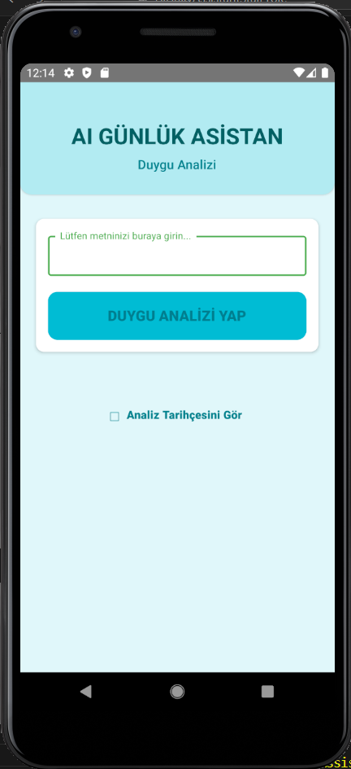
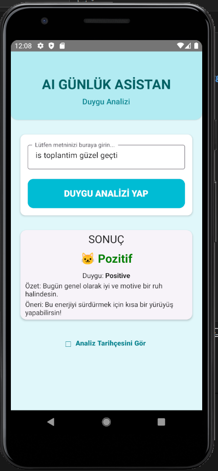
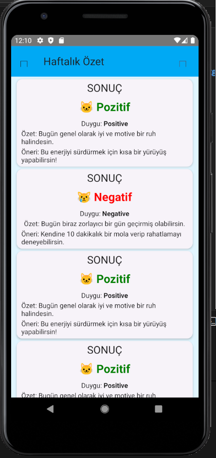
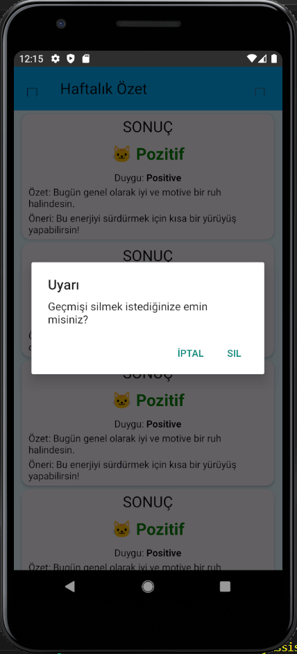

# 🧠 AI GÜNLÜK ASİSTAN: DUYGU ANALİZİ MOBİL UYGULAMASI

Bu proje, **Konuşarak Öğren Stajyer Programı** kapsamında 3 günlük bir mini proje olarak **React Native** ve ücretsiz **Hugging Face API'si** kullanılarak geliştirilmiştir.

---

## 1. 🌟 Proje Özeti ve Kapsam

**Amaç:** Kullanıcının günlük duygu durumunu ve düşüncelerini metin olarak girmesi ve anında geri bildirim alması.

**Çekirdek Özellikler (MVP):**

- **Analiz Ekranı:** Metin girişi, AI ile Duygu Analizi (pozitif/nötr/negatif), Özet ve Öneri gösterimi.
- **Geçmiş Ekranı:** Yapılan tüm analizlerin yerel olarak (AsyncStorage) saklanması ve listelenmesi.
- **Çevrimdışı Yetenek:** İnternet bağlantısı olmasa bile önceki analizler görüntülenebilir.
- **UI/UX:** Duygu durumuna göre arayüz renklerinin değişimi.

---

## 2. 💻 Temel Teknolojiler ve AI Entegrasyonu

Bu proje, modern mobil geliştirme ve yapay zeka araçlarını bir araya getirmektedir:

- **Mobil Platform (React Native CLI):** Hızlı ve yerel uygulama geliştirme.
- **Durum & UI (React Hooks, RN Paper):** Basit durum yönetimi ve estetik Material Design bileşenleri.
- **Veri Saklama (AsyncStorage):** Geçmiş kayıtların yerel ve çevrimdışı tutulması.
- **AI API (Hugging Face Inference API):** Ücretsiz AI uç noktası ve Bearer Token yetkilendirmesi.
- **AI Modeli (savasy/bert-base-turkish-sentiment-cased):** Türkçe metinler için optimize edilmiş BERT tabanlı Duygu Analiz modeli.

---

## 3. ⚙️ Kurulum ve Çalıştırma Adımları

Projenin çalıştırılması için Node, JDK ve Android/iOS ortamlarının hazır olması gerekmektedir.

### A. Bağımlılıklar ve API Anahtarı

Proje dizininde `npm install` komutu ile tüm bağımlılıkları yükleyin.  
Hugging Face üzerinden aldığınız API Token'ını, projenin ana dizinindeki `.env` dosyasına aşağıdaki formatta kaydedin:

HUGGING_FACE_API_KEY="hf_xxxxxxxxxxxxxxxxxxxxxxxxxxx"

--

### B. Uygulamayı Başlatma

Ağ ve önbellek hatalarını önlemek için:

# Önbelleği temizleyerek başlat

npm start -- --reset-cache

# Uygulamayı derle ve çalıştır

npx react-native run-android

# iOS için

npx react-native run-ios

---

## 4. 📝 Geliştirme Süreci ve Hata Ayıklama Özeti

Proje geliştirme sürecinde, kritik işlevselliği sağlamak için çeşitli hata ayıklama adımları uygulanmıştır:

### API Yanıt Güvenilirliği

Hugging Face API'sinin farklı çıktı formatlarına uyum sağlamak için veri işleme mantığı güçlendirilmiştir.

### Veri Bütünlüğü

Hatalı (null) geçmiş kayıtları nedeniyle ortaya çıkan render sorunları, veriye varsayılan değerler atanarak ve bir `ClearHistory` fonksiyonu eklenerek çözülmüştür.

### Ağ ve UI Hataları

- `Cannot read property 'displayName'` (Appbar hatası) önbellek temizliği ile giderilmiştir.
- Android'de `Network Request Failed` hatası, `AndroidManifest.xml` dosyasına `android:usesCleartextTraffic="true"` eklenerek çözülmüş ve stabil ağ bağlantısı sağlanmıştır.

---

5. 📸 Proje Görselleri (Çalışır Demo)

5.1 Günlük Girdi Ekranı (HomeScreen)

   

5.2 Geçmiş Ekranı (HistoryScreen)

   

---

## 6. 💡 AI Araç Kullanım Beyanı

Bu projenin karmaşık API entegrasyonu ve zorlu hata ayıklama aşamaları, **Gemini (Large Language Model)** gibi Yapay Zeka araçlarının aktif yardımıyla gerçekleştirilmiştir. Bu destek, geliştirme hızını artırmış ve projenin kısa sürede tamamlanmasını sağlamıştır.
